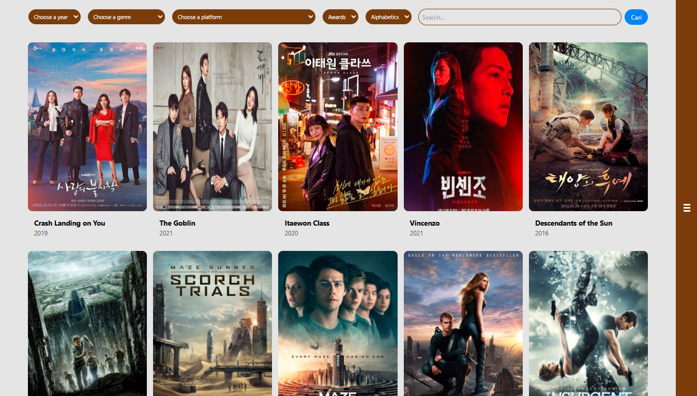
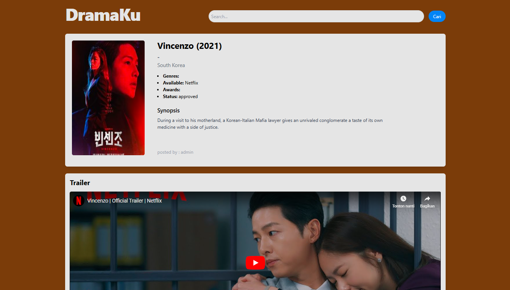
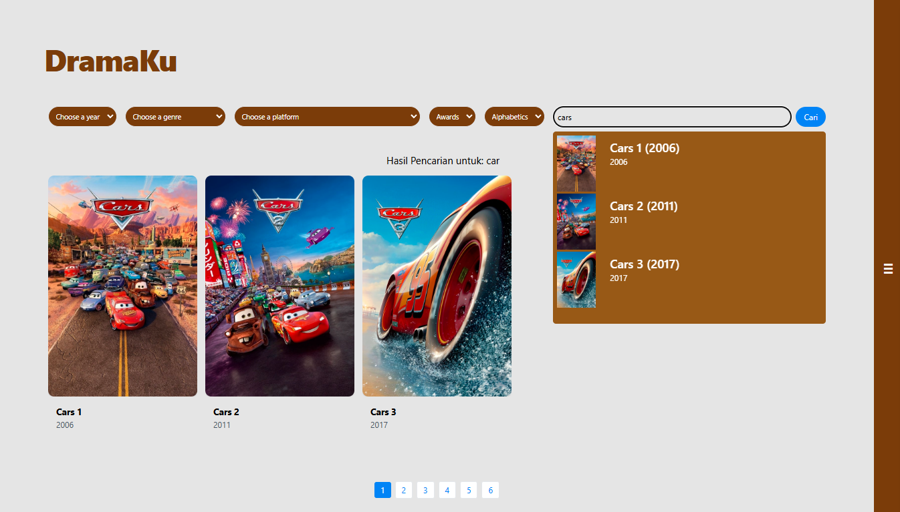

# **Website DramaKu** 

 |  |
|------------------------------------------|------------------------------------------|
|  |  |

Website ini dibuat untuk menyediakan informasi berbagai film yang ada. Informasi detail dari setiap film disertasi dengan rating dan komentar dari user.

# **Developer**

<li>Ferdi Ahmad Ariesta - 221524041
<li>Septyana Agustina - 221524060

<br>

# **Tech Stack**

<details>
  <summary><strong>Frontend<strong></summary>
  <ul>
    <li>React</li>
    <li>Vite</li>
    <li>Tailwind CSS</li>
    <li>React Router</li>
    <li>Fetch API</li>
  </ul>
</details>

<details>
  <summary><strong>Backend</strong></summary>
  <ul>
    <li>PHP</li>
    <li>Laravel</li>
    <li>JWT Authentication</li>
    <li>Google OAuth</li>
  </ul>
</details>

<details>
  <summary><strong>Database</strong></summary>
  <ul>
    <li>PostgreSQL</li>
  </ul>
</details>


<details>
  <summary><strong>Testing</strong></summary>
  <ul>
    <li>Jest</li>
    <li>React Testing Library</li>
  </ul>
</details>

<details>
  <summary><strong>Deployment</strong></summary>
  <ul>
    <li>Docker</li>
    <li>Docker Compose</li>
    <!-- <li>Alibaba Cloud</li> -->
  </ul>
</details>

<br>

# **Installation**

## **Run Locally**

### **Set Up Front-End** 

#### **Clone Project Github**

Tentukan dimana anda akan menyimpan project, dan jalankan perintah berikut:

```bash
  git clone https://github.com/Ferdiahmad3404/web-film.git
```

#### **Pergi ke Directory Front-End**

```bash
  cd web-film/film-frontend
```

#### **Install Front-End Resource**
Jalankan perintah untuk menginstall semua Dependencies yang dibutuhkan oleh front-end

```bash
  npm install
```

### **Set Up Back-End** 

#### **Pergi ke Directory Back-End**

```bash
  cd ../film-backend
```

#### **Install Dependencies Pihak Ketiga**

Buka terminal dan jalankan perintah berikut:

```bash
  composer install
```

#### **Set Up Directory Upload File**

Jalankan perintah berikut dan set up directory upload file

```bash
  php artisan storage:link
```

#### **Buat File Conviguration `.env`**

Salin file `.env.example` untuk membuat file `.env`

```bash
  cp .env.example .env
```

Sesuaikan config database dengan database yang anda gunakan yang ada di dalam file `.env` anda

#### **Atur application key** 

Jalankan perintah untuk membuat application key berikut

```bash
  php artisan key:generate
```

#### **Atur JWT Key**

Jalankan perintah untuk membuat JWT key berikut

```bash
  php artisan jwt:secret
```

#### **Database Migration dan Seeding**

Jalankan perintah untuk membuat tabel dan mengisi data user serta comments 

```bash
  php artisan migrate
  php artisan db:seed
```

#### **Dataset**

Download setiap file csv dan jalankan setiap file python untuk memasukkan datanya ke database pada link berikut:

https://drive.google.com/drive/folders/1uBRGDFGFoq8SKYd-mdrb3KOBvmHrhjBx?usp=drive_link


#### **Running**

Terakhir setelah semuanya selesai, jalankan front-end dan back-end dengan perintah seperti berikut:

Front-End
```bash
  npm run dev
```

Back-end

```bash
  php artisan serve
```

<br>

## **Run Locally with Docker**

### **Pastikan Docker Desktop Sudah Terinstall** 

#### **Pergi ke Directory Back-End**

```bash
  cd film-backend
```
#### **Salin .env.example dan ubah nama menjadi.env**

```bash
  cp .env.example .env
```
#### **Pindah ke folder project utama**

```bash
  cd ..
```
#### **Buat image dan container dengan menggunakan docker compose**

```bash
  docker-compose up --build -d
```

<br>

## **Installation Demo**

Insert gif or link to video

<br>

## **Akun Admin**

**Username:** admin

**Password:** password123
